# Design — Refatoração de Consistência Visual (Design System)

## Visão Geral

Este documento descreve o design técnico para alinhar todos os módulos do Synthropic ao Design System, usando o módulo **partes** como padrão ouro. A refatoração abrange 5 módulos-alvo (processos, contratos, assinatura-digital, audiências, expedientes) e envolve: migração de layout para shells compartilhados, eliminação de funções locais de badge, padronização de tipografia, espaçamento Grid 4px e estrutura FSD.

### Princípios de Design

1. **Centralização**: Toda lógica visual (cores, variantes de badge, tipografia) vive no Design System (`@/lib/design-system` e `@/components/shared`), nunca em módulos de feature.
2. **Consistência via Shells**: `PageShell` e `DataShell` garantem layout uniforme sem duplicação.
3. **FSD Colocado**: Cada módulo segue a mesma estrutura de diretórios e barrel export do padrão ouro.
4. **Migração Incremental**: Cada módulo é refatorado independentemente, validado contra o checklist do Design System antes de merge.

---

## Arquitetura

### Diagrama de Dependências (Design System → Módulos)

```mermaid
graph TD
    DS["@/lib/design-system"]
    CS["@/components/shared"]
    UI["@/components/ui"]

    DS -->|getSemanticBadgeVariant| M1["partes"]
    DS -->|getSemanticBadgeVariant| M2["processos"]
    DS -->|getSemanticBadgeVariant| M3["contratos"]
    DS -->|getSemanticBadgeVariant| M4["assinatura-digital"]
    DS -->|getSemanticBadgeVariant| M5["audiências"]
    DS -->|getSemanticBadgeVariant| M6["expedientes"]

    CS -->|PageShell, DataShell| M1
    CS -->|PageShell, DataShell| M2
    CS -->|PageShell, DataShell| M3
    CS -->|PageShell, DataShell| M4
    CS -->|PageShell, DataShell| M5
    CS -->|PageShell, DataShell| M6

    UI -->|Typography, Badge, AppBadge| M1
    UI -->|Typography, Badge, AppBadge| M2
    UI -->|Typography, Badge, AppBadge| M3
    UI -->|Typography, Badge, AppBadge| M4
    UI -->|Typography, Badge, AppBadge| M5
    UI -->|Typography, Badge, AppBadge| M6
```



### Fluxo de Migração por Módulo

```mermaid
flowchart LR
    A[Auditoria de Violações] --> B[Criar layout.tsx com PageShell]
    B --> C[Migrar headers para Typography]
    C --> D[Migrar badges para getSemanticBadgeVariant]
    D --> E[Substituir paginação manual por DataPagination]
    E --> F[Eliminar cores inline]
    F --> G[Padronizar estrutura FSD]
    G --> H[Atualizar barrel export]
    H --> I[Validar checklist Design System]
```



---

## Componentes e Interfaces

### 1. Padrão de Layout (PageShell via layout.tsx)

O padrão ouro (partes) usa `PageShell` no `layout.tsx` do módulo, envolvendo todos os children:

```tsx
// src/app/(authenticated)/{modulo}/layout.tsx
import { PageShell } from '@/components/shared';

export default function ModuloLayout({ children }: { children: React.ReactNode }) {
  return <PageShell>{children}</PageShell>;
}
```

**Estado atual dos módulos:**

| Módulo | PageShell via layout.tsx | Ação Necessária |
|--------|------------------------|-----------------|
| partes | ✅ Sim | Nenhuma |
| processos | ❌ Não — usa `<div className="space-y-5 py-6">` em `page.tsx` | Criar `layout.tsx` com PageShell, remover wrapper manual |
| contratos | ❌ Não — renderiza `<ContratosClient />` direto | Criar `layout.tsx` com PageShell |
| assinatura-digital | ⚠️ Parcial — sub-rotas (templates, formulários, documentos/lista) já usam PageShell | Verificar cobertura completa |
| audiências | ✅ Sim — já possui `layout.tsx` com PageShell | Nenhuma |
| expedientes | ❌ Não — renderiza `<ExpedientesContent>` em `<Suspense>` sem PageShell | Criar `layout.tsx` com PageShell |

### 2. Padrão de Tipografia (Heading)

O padrão ouro usa `Heading` do Typography para títulos de página:

```tsx
import { Heading } from '@/components/ui/typography';
<Heading level="page">Processos</Heading>
```

**Estado atual:**
- **processos**: ✅ Já usa `Heading` em `processos-client.tsx`
- **contratos**: ❌ Constrói headers manualmente em `contratos-client.tsx`
- **assinatura-digital**: ❌ Verificar uso em sub-páginas
- **audiências**: ❌ Constrói headers manualmente em `audiencias-client.tsx`
- **expedientes**: ❌ Constrói headers manualmente em `expedientes-content.tsx`

### 3. Padrão de Tabelas (DataShell + DataTableToolbar)

```tsx
import { DataShell } from '@/components/shared/data-shell';
import { DataTableToolbar } from '@/components/shared/data-table-toolbar';

<DataShell toolbar={<DataTableToolbar ... />}>
  <DataTable columns={columns} data={data} />
</DataShell>
```

### 4. Padrão de Paginação (DataPagination)

O módulo processos usa paginação manual com botões `‹` e `›` com classes inline. Deve ser substituída por `DataPagination` do DataShell:

```tsx
import { DataPagination } from '@/components/shared/data-shell/data-pagination';

<DataPagination
  pageIndex={pageIndex}
  pageCount={totalPages}
  onPageChange={setPageIndex}
/>
```

### 5. Padrão de Badges (getSemanticBadgeVariant)

Todas as variantes de badge devem usar o mapeamento centralizado:

```tsx
import { getSemanticBadgeVariant } from '@/lib/design-system';
import { Badge } from '@/components/ui/badge';

<Badge variant={getSemanticBadgeVariant('status_contrato', contrato.status)}>
  {formatarStatusContrato(contrato.status)}
</Badge>
```

**Funções locais a eliminar:**

| Módulo | Funções a Remover | Categoria no variants.ts |
|--------|-------------------|--------------------------|
| contratos | `getStatusBadgeStyle`, `getTipoContratoBadgeStyle`, `getStatusVariant`, `getTipoContratoVariant` | `status_contrato`, `tipo_contrato`, `tipo_cobranca` (já existem) |
| assinatura-digital | `getStatusBadgeVariant`, `getAtivoBadgeVariant`, `getBooleanBadgeVariant` | Criar categorias `template_status`, `ativo_status` em variants.ts |
| expedientes | `getStatusBadgeStyle` (local em `expediente-detalhes-dialog.tsx`) | Criar categoria `expediente_status` em variants.ts |
| contratos/[id] | `getStatusBadgeVariant` (local em `contrato-financeiro-card.tsx`) | Usar `payment_status` (já existe) |

### 6. Novas Categorias de Badge a Registrar

Para eliminar funções locais, as seguintes categorias devem ser adicionadas em `@/lib/design-system/variants.ts`:

```typescript
// Em variants.ts — novas categorias

export const TEMPLATE_STATUS_VARIANTS: Record<string, BadgeVisualVariant> = {
  ativo: 'success',
  inativo: 'danger',
  rascunho: 'neutral',
};

export const ATIVO_STATUS_VARIANTS: Record<string, BadgeVisualVariant> = {
  true: 'success',
  false: 'neutral',
};

export const EXPEDIENTE_STATUS_VARIANTS: Record<string, BadgeVisualVariant> = {
  pendente: 'warning',
  baixado: 'neutral',
};
```

E adicionar os cases correspondentes no switch de `getSemanticBadgeVariant`.

---

## Modelos de Dados

### Estrutura FSD Padrão (Padrão Ouro — partes)

```
src/app/(authenticated)/{modulo}/
├── domain.ts           # Zod schemas, tipos TypeScript, regras de estado puro
├── service.ts          # Casos de uso e orquestração
├── repository.ts       # Queries Supabase isoladas
├── actions/            # Server Actions (pasta com index.ts)
│   ├── index.ts        # Re-exporta todas as actions
│   └── {dominio}-actions.ts
├── components/         # UI React local
│   ├── index.ts        # Barrel export de componentes
│   └── ...
├── hooks/              # Custom hooks
│   ├── index.ts
│   └── ...
├── types/              # Tipos auxiliares (opcional)
│   └── index.ts
├── utils/              # Utilitários locais (opcional)
│   └── index.ts
├── index.ts            # Barrel export — API pública do módulo
├── layout.tsx          # PageShell wrapper
├── page.tsx            # Server Component da rota principal
├── {modulo}-client.tsx # Client Component principal
└── RULES.md            # Regras de negócio para agentes IA
```

### Gap Analysis — Estrutura FSD por Módulo

| Arquivo/Pasta | partes ✅ | processos | contratos | assinatura-digital | audiências | expedientes |
|---------------|-----------|-----------|-----------|-------------------|------------|-------------|
| `domain.ts` | ✅ | ✅ | ✅ | ✅ (em feature/) | ✅ | ✅ |
| `service.ts` | ✅ | ✅ | ✅ | ✅ (em feature/) | ✅ | ✅ |
| `repository.ts` | ✅ | ✅ | ✅ | ✅ (em feature/) | ✅ | ✅ |
| `actions/` (pasta) | ✅ | ✅ | ✅ | ⚠️ `actions.ts` arquivo | ❌ `actions.ts` arquivo | ❌ `actions.ts` + `actions-bulk.ts` |
| `components/` | ✅ | ✅ | ✅ | ✅ (em feature/) | ✅ | ✅ |
| `hooks/` | ✅ | ✅ | ✅ | ✅ (em feature/) | ✅ | ✅ |
| `index.ts` (barrel) | ✅ Organizado | ✅ | ✅ | ✅ (em feature/) | ✅ | ⚠️ Sem seções |
| `layout.tsx` | ✅ | ❌ | ❌ | ⚠️ Parcial | ✅ | ❌ |
| `RULES.md` | ✅ | ✅ | ✅ | ✅ (em feature/) | ✅ | ✅ |

### Ações de Migração FSD por Módulo

**processos**: Criar `layout.tsx`. Estrutura FSD já está boa.

**contratos**: Criar `layout.tsx`. Estrutura FSD já está boa.

**assinatura-digital**: Módulo tem estrutura aninhada em `feature/`. O `actions.ts` na raiz de `feature/` deve ser migrado para `feature/actions/` com `index.ts`. O barrel export em `feature/index.ts` deve ser reorganizado com seções claras.

**audiências**: `actions.ts` (arquivo único na raiz) → migrar para `actions/index.ts` + arquivos separados. `services/` (com subserviços `ai-agent.service.ts`, `responsavel.service.ts`, `virtual.service.ts`) → consolidar em `service.ts` na raiz ou manter `services/` com barrel export.

**expedientes**: `actions.ts` + `actions-bulk.ts` → migrar para `actions/` com `index.ts`. Barrel export precisa de seções organizadas.

### Barrel Export — Formato Padrão

```typescript
// index.ts — Formato padrão com seções

// ============================================================================
// Components
// ============================================================================
export { ... } from './components';

// ============================================================================
// Hooks
// ============================================================================
export { ... } from './hooks';

// ============================================================================
// Actions
// ============================================================================
export { ... } from './actions';

// ============================================================================
// Types / Domain
// ============================================================================
export type { ... } from './domain';
export { ... } from './domain';

// ============================================================================
// Utils
// ============================================================================
export { ... } from './utils';

// ============================================================================
// Errors
// ============================================================================
export { ... } from './errors';
```

---

## Propriedades de Corretude

*Uma propriedade é uma característica ou comportamento que deve ser verdadeiro em todas as execuções válidas de um sistema — essencialmente, uma declaração formal sobre o que o sistema deve fazer. Propriedades servem como ponte entre especificações legíveis por humanos e garantias de corretude verificáveis por máquina.*

A grande maioria dos critérios de aceitação desta feature são verificações estruturais/estáticas (SMOKE tests): existência de arquivos, ausência de padrões proibidos, uso correto de componentes. Esses são melhor testados via análise estática (grep, lint, architecture checker) e não se beneficiam de property-based testing.

No entanto, existe uma propriedade central testável: a função `getSemanticBadgeVariant` deve cobrir todos os valores de domínio registrados sem cair no fallback `neutral`.

### Property 1: Cobertura completa de variantes de badge para todos os valores de domínio

*Para qualquer* categoria de badge registrada e *para qualquer* valor válido do domínio correspondente (ex: todos os `StatusContrato`, todos os `TipoContrato`, todos os `StatusTemplate`, todos os `StatusAudiencia`, etc.), a função `getSemanticBadgeVariant(categoria, valor)` deve retornar uma variante diferente de `'neutral'`.

**Validates: Requirements 2.5, 3.4, 4.2, 8.5**

### Property 2: Idempotência da normalização de badge variant

*Para qualquer* categoria de badge e *para qualquer* valor de entrada (incluindo variações de case e espaçamento), chamar `getSemanticBadgeVariant` duas vezes com o mesmo input deve retornar o mesmo resultado. Ou seja, `getSemanticBadgeVariant(cat, val) === getSemanticBadgeVariant(cat, val)` para todos os inputs válidos.

**Validates: Requirements 8.5**

---

## Tratamento de Erros

### Estratégia de Migração Segura

1. **Fallback gracioso**: Se `getSemanticBadgeVariant` receber um valor não mapeado, retorna `'neutral'` em vez de lançar erro. Isso garante que badges nunca quebrem a UI durante a migração.

2. **Validação em build-time**: O `npm run check:architecture` valida que nenhum módulo externo importa de subpastas. Falhas bloqueiam o CI.

3. **Validação de exports**: O `npm run validate:exports` garante que barrel exports estão completos. Falhas bloqueiam o CI.

4. **Migração incremental**: Cada módulo é migrado em branch separada. Se um módulo tiver regressão visual, o rollback é isolado.

### Cenários de Erro Específicos

| Cenário | Tratamento |
|---------|------------|
| Badge com valor não mapeado | `getSemanticBadgeVariant` retorna `'neutral'` (fallback seguro) |
| Import de subpasta cross-módulo | `check:architecture` falha no CI |
| Barrel export incompleto | `validate:exports` falha no CI |
| Componente sem PageShell | Revisão manual + smoke test |
| Espaçamento fora do Grid 4px | Lint customizado ou revisão manual |

---

## Estratégia de Testes

### Abordagem Dual

Esta feature combina dois tipos de teste:

1. **Smoke tests / Análise estática**: Para a maioria dos critérios (verificações estruturais)
2. **Property-based tests**: Para a função centralizada `getSemanticBadgeVariant`

### Smoke Tests (Análise Estática)

Testes automatizados via scripts/grep que verificam:

- Ausência de `bg-{cor}-{shade}` em componentes de feature
- Ausência de funções `getXXXColorClass()` locais
- Ausência de `shadow-xl` e `oklch()` direto
- Existência de `layout.tsx` com `PageShell` em cada módulo
- Existência de `RULES.md`, `domain.ts`, `service.ts`, `repository.ts`, `actions/`, `index.ts`
- Barrel exports organizados por seção
- Espaçamentos dentro do conjunto permitido do Grid 4px

Esses testes podem ser implementados como scripts no CI ou como testes Jest que fazem `fs.readFileSync` + regex.

### Property-Based Tests

Biblioteca: **fast-check** (já disponível no ecossistema Jest/TypeScript do projeto)

Configuração: mínimo 100 iterações por propriedade.

```typescript
// Exemplo de implementação
// Feature: design-system-consistency-refactor, Property 1: Cobertura completa de variantes de badge
import fc from 'fast-check';
import { getSemanticBadgeVariant } from '@/lib/design-system';

// Gerar pares (categoria, valor) a partir dos enums de domínio
const categoryValuePairs = fc.oneof(
  fc.constant(['status_contrato', 'em_contratacao'] as const),
  fc.constant(['status_contrato', 'contratado'] as const),
  fc.constant(['tipo_contrato', 'ajuizamento'] as const),
  // ... todos os valores registrados
);

test('Property 1: Cobertura completa de variantes', () => {
  fc.assert(
    fc.property(categoryValuePairs, ([category, value]) => {
      const result = getSemanticBadgeVariant(category, value);
      expect(result).not.toBe('neutral');
    }),
    { numRuns: 100 }
  );
});
```

### Unit Tests (Exemplos Específicos)

- Verificar que `processos/layout.tsx` renderiza `PageShell`
- Verificar que `contratos/utils/formatters.ts` não contém mais `getStatusBadgeStyle`
- Verificar que `assinatura-digital/feature/utils/display.ts` não contém mais `getStatusBadgeVariant` local
- Verificar que `expedientes/actions/index.ts` re-exporta todas as actions

### Integração com CI

- `npm run check:architecture` — valida regras de importação FSD
- `npm run validate:exports` — valida barrel exports
- `npm test` — executa smoke tests + property tests
- `npm run lint` — ESLint para padrões de código
