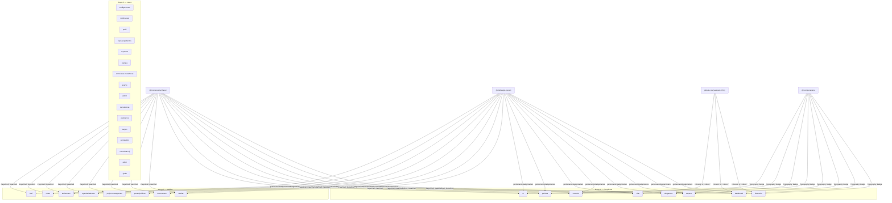
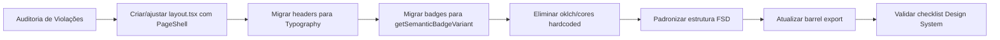

# Design — Fase 2: Refatoração do Design System (Módulos Restantes)

## Visão Geral

Este documento descreve o design técnico para a Fase 2 da refatoração de consistência visual do Synthropic/Zattar OS. A Fase 1 migrou com sucesso 6 módulos (partes, processos, contratos, assinatura-digital, audiências, expedientes). A Fase 2 expande para os 32 módulos restantes, organizados em 3 grupos por complexidade.

A Fase 2 introduz desafios técnicos adicionais não presentes na Fase 1:
- **oklch() direto** em widgets de gráficos (dashboard, financeiro, agenda) — requer estratégia de paleta de gráficos via variáveis CSS
- **Cores hardcoded massivas** no chat (15+ componentes de videochamada com `bg-gray-*`) — requer variáveis CSS semânticas para tema escuro
- **Funções locais de badge** em perícias e obrigações — novas categorias em `variants.ts`
- **Estruturas FSD muito divergentes** — financeiro (domain/, services/, repository/), dashboard (repositories/, services/), captura (services/ com 12+ subserviços), project-management (tudo em lib/), assistentes (estrutura duplicada raiz/feature)
- **Módulos de serviço sem page.tsx** (endereços, cargos, advogados, calculadoras) — tratamento diferenciado

### Princípios de Design (herdados da Fase 1)

1. **Centralização**: Toda lógica visual (cores, variantes de badge, tipografia) vive no Design System (`@/lib/design-system` e `@/components/shared`), nunca em módulos de feature.
2. **Consistência via Shells**: `PageShell` e `DataShell` garantem layout uniforme sem duplicação.
3. **FSD Colocado**: Cada módulo segue a mesma estrutura de diretórios e barrel export do padrão ouro.
4. **Migração Incremental**: Cada módulo é refatorado independentemente, validado contra o checklist do Design System antes de merge.
5. **Tema-agnóstico**: Componentes de feature nunca referenciam cores diretamente — usam variáveis CSS semânticas que se adaptam a light/dark mode.

---

## Arquitetura

### Diagrama de Dependências (Design System → Módulos Fase 2)




### Fluxo de Migração por Módulo (mesmo da Fase 1)



### Ordem de Migração Recomendada

A migração segue a ordem: dependências compartilhadas → Grupo A → Grupo B → Grupo C → validação.

```mermaid
gantt
    title Ordem de Migração — Fase 2
    dateFormat X
    axisFormat %s

    section Pré-requisitos
    Registrar novas categorias badge    :0, 1
    Criar variáveis CSS gráficos        :0, 1
    Criar variáveis CSS videochamada    :0, 1

    section Grupo A (Complexos)
    financeiro                          :1, 3
    dashboard                           :1, 3
    captura                             :2, 3
    obrigacoes                          :2, 4
    usuarios                            :3, 4
    chat                                :3, 5
    pericias                            :4, 5
    rh                                  :4, 5

    section Grupo B (Médios)
    tarefas                             :5, 6
    documentos                          :5, 6
    pecas-juridicas                     :5, 6
    project-management                  :5, 7
    agenda/calendar                     :6, 7
    assistentes                         :6, 7
    notas                               :6, 7
    mail                                :6, 7

    section Grupo C (Leves)
    Batch C1 (config, notif, perfil)    :7, 8
    Batch C2 (tipos-exp, repasses, pangea) :7, 8
    Batch C3 (entrevistas, acervo, admin) :8, 9
    Batch C4 (calc, end, cargos, adv)   :8, 9
    Batch C5 (comunica, editor, ajuda)  :8, 9

    section Validação
    Testes cross-módulo                 :9, 10
```



---

## Componentes e Interfaces

### 1. Estratégia para oklch() → Variáveis CSS do Tema

O uso de `oklch()` direto viola o Design System porque acopla componentes de feature ao espaço de cor. A Fase 2 encontrou ~25 ocorrências em 3 áreas:

**Área 1 — Widgets de gráficos (dashboard, financeiro)**
Usam `oklch(from var(--primary) l c h / 0.50)` para derivar cores de segmentos de treemap, funnel e aging charts.

**Área 2 — Mocks de dashboard**
Usam `oklch()` para paletas de gráficos em dados mockados.

**Área 3 — Efeitos de glow/shadow**
Usam `shadow-[0_0_Xpx_oklch(...)]` para efeitos de brilho em indicadores de urgência e timeline.

**Solução: Variáveis CSS de paleta de gráficos**

Adicionar em `globals.css` variáveis semânticas para gráficos que se adaptam ao tema:

```css
/* globals.css — Paleta de gráficos */
:root {
  /* Segmentos de gráfico (já existem --chart-1..5, expandir) */
  --chart-6: oklch(0.65 0.15 200);
  --chart-7: oklch(0.60 0.18 320);
  --chart-8: oklch(0.70 0.12 80);

  /* Tons derivados para treemaps e funnels */
  --chart-primary-soft: oklch(from var(--primary) l c h / 0.50);
  --chart-destructive-soft: oklch(from var(--destructive) l c h / 0.45);
  --chart-warning-soft: oklch(from var(--warning) l c h / 0.45);
  --chart-success-soft: oklch(from var(--success) l c h / 0.50);
  --chart-muted-soft: oklch(from var(--muted-foreground) l c h / 0.40);

  /* Glow effects */
  --glow-primary: oklch(from var(--primary) l c h / 0.35);
  --glow-destructive: oklch(from var(--destructive) l c h / 0.50);
  --glow-warning: oklch(from var(--warning) l c h / 0.40);
}

.dark {
  --chart-primary-soft: oklch(from var(--primary) l c h / 0.35);
  --chart-destructive-soft: oklch(from var(--destructive) l c h / 0.30);
  --chart-warning-soft: oklch(from var(--warning) l c h / 0.30);
  --chart-success-soft: oklch(from var(--success) l c h / 0.35);
  --chart-muted-soft: oklch(from var(--muted-foreground) l c h / 0.25);

  --glow-primary: oklch(from var(--primary) l c h / 0.25);
  --glow-destructive: oklch(from var(--destructive) l c h / 0.35);
  --glow-warning: oklch(from var(--warning) l c h / 0.30);
}
```

**Migração nos componentes:**

```tsx
// ANTES (oklch direto — PROIBIDO)
const TIPO_CONFIG = {
  acordo: { color: 'oklch(from var(--primary) l c h / 0.50)' },
};

// DEPOIS (variável CSS — CORRETO)
const TIPO_CONFIG = {
  acordo: { color: 'var(--chart-primary-soft)' },
};

// ANTES (glow com oklch — PROIBIDO)
className="shadow-[0_0_8px_oklch(from var(--destructive) l c h / 0.5)]"

// DEPOIS (variável CSS — CORRETO)
className="shadow-[0_0_8px_var(--glow-destructive)]"
```

**Helper de Semantic Tone (já existente)**

O sistema já possui `SemanticTone` em `src/app/(dev)/library/tokens/semantic-tones/`. Os widgets de dashboard que retornam `color: 'oklch(...)'` devem migrar para `tone: SemanticTone` e resolver a cor via helper na camada UI.

### 2. Estratégia para Cores Hardcoded do Chat → Variáveis Semânticas

O módulo chat possui 15+ componentes de videochamada com cores `bg-gray-950`, `bg-gray-900`, `bg-gray-800`, `bg-gray-700`, `bg-gray-600` hardcoded. Esses componentes usam tema escuro fixo (videochamada sempre tem fundo escuro).

**Solução: Variáveis CSS semânticas para contexto de vídeo**

```css
/* globals.css — Contexto de videochamada */
:root {
  --video-bg: var(--color-gray-950);
  --video-surface: var(--color-gray-900);
  --video-surface-hover: var(--color-gray-800);
  --video-border: var(--color-gray-800);
  --video-muted: var(--color-gray-400);
  --video-text: var(--color-white);
  --video-skeleton: var(--color-gray-800);
}
/* Nota: videochamada é sempre dark, não precisa de override .dark */
```

**Migração nos componentes:**

```tsx
// ANTES (hardcoded — PROIBIDO)
<div className="bg-gray-950 text-white border-gray-800">

// DEPOIS (variáveis semânticas — CORRETO)
<div className="bg-[var(--video-bg)] text-[var(--video-text)] border-[var(--video-border)]">
```

**Alternativa mais simples (preferida):** Usar as classes semânticas do Tailwind que já existem:

```tsx
// MELHOR — usar classes semânticas existentes do tema
<div className="bg-background text-foreground border-border">

// Para contexto de vídeo (sempre escuro), envolver com data-theme="dark"
<div data-theme="dark" className="bg-background text-foreground border-border">
```

A decisão entre variáveis `--video-*` e `data-theme="dark"` depende de se o projeto já usa `data-theme` para scoped theming. Se sim, `data-theme="dark"` é mais limpo. Se não, variáveis `--video-*` são mais explícitas.

**Recomendação:** Usar `data-theme="dark"` no wrapper do componente de videochamada e substituir todas as classes `bg-gray-*` por classes semânticas (`bg-background`, `bg-card`, `bg-muted`, `border-border`, `text-muted-foreground`).

### 3. Novas Categorias de Badge a Registrar

Para eliminar funções locais da Fase 2, as seguintes categorias devem ser adicionadas em `@/lib/design-system/variants.ts`:

```typescript
// === PERÍCIAS ===
export const PERICIA_SITUACAO_VARIANTS: Record<string, BadgeVisualVariant> = {
  F: 'success',      // Finalizada
  A: 'info',         // Agendada
  C: 'destructive',  // Cancelada
  R: 'warning',      // Reagendada
  P: 'secondary',    // Pendente
  FINALIZADA: 'success',
  AGENDADA: 'info',
  CANCELADA: 'destructive',
  REAGENDADA: 'warning',
  PENDENTE: 'secondary',
};

// === PARCELAS (OBRIGAÇÕES) ===
export const PARCELA_STATUS_VARIANTS: Record<string, BadgeVisualVariant> = {
  pendente: 'warning',
  PENDENTE: 'warning',
  paga: 'success',
  PAGA: 'success',
  vencida: 'destructive',
  VENCIDA: 'destructive',
  cancelada: 'neutral',
  CANCELADA: 'neutral',
};

// === REPASSES (OBRIGAÇÕES) ===
export const REPASSE_STATUS_VARIANTS: Record<string, BadgeVisualVariant> = {
  nao_aplicavel: 'neutral',
  NAO_APLICAVEL: 'neutral',
  NAOAPLICAVEL: 'neutral',
  pendente_declaracao: 'warning',
  PENDENTE_DECLARACAO: 'warning',
  PENDENTEDECLARACAO: 'warning',
  pendente_transferencia: 'info',
  PENDENTE_TRANSFERENCIA: 'info',
  PENDENTETRANSFERENCIA: 'info',
  realizado: 'success',
  REALIZADO: 'success',
};
```

E adicionar os cases correspondentes no switch de `getSemanticBadgeVariant`, além de expandir o tipo `BadgeCategory`:

```typescript
export type BadgeCategory =
  | /* ...existentes... */
  | 'pericia_situacao'
  | 'parcela_status'
  | 'repasse_status';
```

**Funções locais a eliminar:**

| Módulo | Funções a Remover | Nova Categoria |
|--------|-------------------|----------------|
| pericias/columns.tsx | `getSituacaoVariant` | `pericia_situacao` |
| pericias/pericia-detalhes-dialog.tsx | `getSituacaoVariant` (duplicada) | `pericia_situacao` |
| pericias/pericias-day-list.tsx | `getBadgeVariant` | `pericia_situacao` |
| obrigacoes/utils.ts | `getTipoColorClass`, `getDirecaoColorClass`, `getStatusColorClass` | já existem: `obrigacao_tipo`, `obrigacao_direcao`, `obrigacao_status` |
| obrigacoes/repasses-pendentes-list.tsx | `getStatusBadge` | `repasse_status` |
| obrigacoes/parcelas-table.tsx | `getStatusBadge`, `getStatusRepasseBadge` | `parcela_status`, `repasse_status` |

### 4. Padrão de Layout (PageShell via layout.tsx)

Mesmo padrão da Fase 1. Estado atual dos módulos da Fase 2:

| Módulo | PageShell | Ação |
|--------|-----------|------|
| financeiro | ❌ layout.tsx existe mas usa `<div>` manual | Substituir por PageShell |
| dashboard | ✅ Já usa PageShell | Nenhuma |
| captura | ⚠️ Sub-páginas usam PageShell individualmente | Verificar cobertura |
| obrigacoes | ⚠️ Parcial (editar, novo sim; lista, calendário não) | Criar layout.tsx |
| usuarios | ❌ page.tsx renderiza direto | Criar layout.tsx |
| chat | ❌ page.tsx renderiza `<ChatLayout>` direto | Criar layout.tsx |
| pericias | ⚠️ Cada sub-página usa PageShell individualmente | Criar layout.tsx centralizado |
| rh | ❌ page.tsx client component usa PageShell direto | Criar layout.tsx |
| tarefas | ✅ Já usa PageShell | Nenhuma |
| documentos | ❌ page.tsx usa PageShell direto | Criar layout.tsx |
| pecas-juridicas | ❌ page.tsx usa PageShell direto | Criar layout.tsx |
| project-management | ❌ layout.tsx existe mas usa `<div>` manual | Substituir por PageShell |
| agenda | ❌ page.tsx renderiza `<AgendaApp>` direto | Criar layout.tsx |
| assistentes | ❌ page.tsx usa PageShell direto | Criar layout.tsx |
| notas | ❌ page.tsx renderiza `<NotesApp>` direto | Criar layout.tsx |
| mail | ❌ page.tsx renderiza `<Mail>` direto | Criar layout.tsx |
| configuracoes | ❌ Sem layout.tsx | Criar layout.tsx |
| notificacoes | ❌ page.tsx renderiza direto | Criar layout.tsx |
| perfil | ❌ page.tsx usa PageShell direto | Criar layout.tsx |
| tipos-expedientes | ❌ page.tsx usa PageShell direto | Criar layout.tsx |
| repasses | ❌ page.tsx usa PageShell direto | Criar layout.tsx |
| pangea | ❌ page.tsx usa PageShell direto | Criar layout.tsx |
| acervo | ❌ Sem page.tsx (módulo de serviço) | N/A — sem página |
| admin | ❌ Sem page.tsx na raiz | Verificar sub-rotas |
| calculadoras | ❌ Módulo mínimo | N/A — sem página |
| enderecos | ❌ Módulo de serviço sem page.tsx | N/A — sem página |
| cargos | ❌ Módulo de serviço sem page.tsx | N/A — sem página |
| advogados | ❌ Módulo de serviço sem page.tsx | N/A — sem página |

**Módulos de serviço (sem page.tsx):** endereços, cargos, advogados, calculadoras — não precisam de layout.tsx nem PageShell. Precisam apenas de estrutura FSD (domain.ts, service.ts, repository.ts, index.ts, RULES.md).


---

## Modelos de Dados

### Estrutura FSD Padrão (Padrão Ouro — partes)

```
src/app/(authenticated)/{modulo}/
├── domain.ts           # Zod schemas, tipos TypeScript, regras de estado puro
├── service.ts          # Casos de uso e orquestração
├── repository.ts       # Queries Supabase isoladas
├── actions/            # Server Actions (pasta com index.ts)
│   ├── index.ts
│   └── {dominio}-actions.ts
├── components/
│   ├── index.ts
│   └── ...
├── hooks/
│   ├── index.ts
│   └── ...
├── index.ts            # Barrel export — API pública do módulo
├── layout.tsx          # PageShell wrapper (apenas módulos com página)
├── page.tsx            # Server Component da rota principal
├── {modulo}-client.tsx # Client Component principal
└── RULES.md            # Regras de negócio para agentes IA
```

### Gap Analysis — Estrutura FSD por Módulo (Fase 2)

#### Grupo A — Módulos Complexos

| Arquivo/Pasta | financeiro | dashboard | captura | obrigacoes | usuarios | chat | pericias | rh |
|---------------|-----------|-----------|---------|------------|----------|------|----------|-----|
| `domain.ts` | ❌ `domain/` (pasta) | ✅ | ✅ | ✅ | ✅ | ❌ `components/types.ts` | ✅ + `types.ts` extra | ❌ `types.ts` |
| `service.ts` | ❌ `services/` (pasta) | ❌ `services/` (pasta) | ❌ `services/` (12+ sub) | ✅ | ❌ `services/` (pasta) | ✅ | ✅ | ✅ |
| `repository.ts` | ❌ `repository/` (pasta) | ❌ `repositories/` (pasta) | ✅ | ✅ | ❌ 4 repos separados | ✅ | ✅ | ✅ |
| `actions/` (pasta) | ❌ `server-actions.ts` | ✅ | ❌ sem barrel | ❌ `server-actions.ts` + `actions/` | ❌ sem barrel | ❌ sem barrel | ❌ sem barrel | ❌ actions espalhadas |
| `index.ts` (barrel) | ⚠️ | ⚠️ | ⚠️ | ⚠️ | ⚠️ | ❌ | ⚠️ | ⚠️ |
| `layout.tsx` | ❌ sem PageShell | ✅ | ⚠️ parcial | ❌ | ❌ | ❌ | ❌ | ❌ |
| `RULES.md` | ✅ | ✅ | ✅ | ✅ | ✅ | ⚠️ | ✅ | ✅ |

#### Grupo B — Módulos Médios

| Arquivo/Pasta | tarefas | documentos | pecas-juridicas | project-mgmt | agenda | assistentes | notas | mail |
|---------------|---------|------------|-----------------|-------------|--------|-------------|-------|------|
| `domain.ts` | ✅ | ✅ | ✅ | ❌ em `lib/` | ✅ | ✅ (duplicado raiz/feature) | ✅ | ❌ |
| `service.ts` | ✅ | ❌ `services/` | ✅ | ❌ em `lib/services/` | ✅ | ✅ (duplicado) | ✅ | ❌ |
| `repository.ts` | ✅ | ✅ | ✅ | ❌ em `lib/repositories/` | ✅ | ✅ (duplicado) | ✅ | ❌ |
| `actions/` (pasta) | ❌ sem barrel | ❌ sem barrel | ✅ | ❌ em `lib/actions/` | ❌ sem barrel | ❌ `actions.ts` arquivo | ❌ | ❌ |
| `index.ts` | ⚠️ | ⚠️ | ⚠️ | ❌ | ⚠️ | ⚠️ | ⚠️ | ❌ |
| `layout.tsx` | ✅ | ❌ | ❌ | ❌ sem PageShell | ❌ | ❌ | ❌ | ❌ |
| `RULES.md` | ✅ | ✅ | ✅ | ❌ | ✅ | ✅ | ⚠️ | ❌ |

#### Grupo C — Módulos Leves

Os módulos do Grupo C dividem-se em dois tipos:

**Com página renderizável:** configuracoes, notificacoes, perfil, tipos-expedientes, repasses, pangea, acervo, admin, comunica-cnj, editor, ajuda
→ Precisam de layout.tsx com PageShell + estrutura FSD completa

**Módulos de serviço (sem page.tsx):** entrevistas-trabalhistas, calculadoras, enderecos, cargos, advogados
→ Precisam apenas de estrutura FSD (domain.ts, service.ts, repository.ts, actions/, index.ts, RULES.md)

### Ações de Migração FSD por Módulo

**financeiro:** `domain/` (pasta com múltiplos arquivos) → `domain.ts` com re-exports. `services/` → `service.ts`. `repository/` → `repository.ts`. `server-actions.ts` + `server.ts` → `actions/index.ts`.

**dashboard:** `repositories/` → `repository.ts`. `services/` → `service.ts`. Manter `widgets/`, `mock/`, `registry/` como subpastas de componentes especializados.

**captura:** `services/` (12+ subserviços) → manter `services/` com barrel export `services/index.ts` (exceção justificada pela complexidade). Criar `actions/index.ts`.

**obrigacoes:** Remover `server-actions.ts` e `server.ts` da raiz. Consolidar em `actions/index.ts`.

**usuarios:** Unificar `repository.ts`, `repository-atividades.ts`, `repository-audit-atividades.ts`, `repository-auth-logs.ts` em `repository.ts` com re-exports. `services/` → `service.ts`. `types/` → `domain.ts`. Criar `actions/index.ts`.

**chat:** Mover `components/types.ts` → `domain.ts`. Mover `components/useChatStore.ts` → `hooks/` ou `store.ts`. Unificar `utils/` (pasta) e `utils.ts` (arquivo). Criar `actions/index.ts`.

**pericias:** Consolidar `types.ts` dentro de `domain.ts`. Criar `actions/index.ts` (barrel para `actions/pericias-actions.ts`).

**rh:** Consolidar `types.ts` dentro de `domain.ts`. Criar `actions/index.ts` (barrel para `folhas-pagamento-actions.ts`, `salarios-actions.ts`).

**project-management:** Mover `lib/domain.ts` → `domain.ts` na raiz. `lib/services/` → `service.ts`. `lib/repositories/` → `repository.ts`. `lib/actions/` → `actions/`. Criar `RULES.md` e `index.ts`.

**assistentes:** Unificar estrutura duplicada raiz/feature. Manter uma única camada. Migrar `actions.ts` (arquivo) → `actions/index.ts`.

**notas:** Mover componentes da raiz (note-app.tsx, note-content.tsx, etc.) → `components/`. Criar `actions/index.ts`.

**mail:** Criar estrutura FSD completa: `domain.ts`, `service.ts`, `repository.ts`, `actions/index.ts`, `index.ts`. Mover `use-mail.ts` → `hooks/`. Mover `lib/` → `utils/`.

### Barrel Export — Formato Padrão (mesmo da Fase 1)

```typescript
// index.ts — Formato padrão com seções
// ============================================================================
// Components
// ============================================================================
export { ... } from './components';

// ============================================================================
// Hooks
// ============================================================================
export { ... } from './hooks';

// ============================================================================
// Actions
// ============================================================================
export { ... } from './actions';

// ============================================================================
// Types / Domain
// ============================================================================
export type { ... } from './domain';
export { ... } from './domain';

// ============================================================================
// Utils
// ============================================================================
export { ... } from './utils';
```


---

## Propriedades de Corretude

*Uma propriedade é uma característica ou comportamento que deve ser verdadeiro em todas as execuções válidas de um sistema — essencialmente, uma declaração formal sobre o que o sistema deve fazer. Propriedades servem como ponte entre especificações legíveis por humanos e garantias de corretude verificáveis por máquina.*

A grande maioria dos critérios de aceitação desta feature são verificações estruturais/estáticas (SMOKE tests): existência de arquivos, ausência de padrões proibidos, uso correto de componentes. Esses são melhor testados via análise estática (grep, lint, architecture checker) e não se beneficiam de property-based testing.

A propriedade central testável continua sendo a função `getSemanticBadgeVariant`, agora expandida com as novas categorias da Fase 2 (`pericia_situacao`, `parcela_status`, `repasse_status`).

### Property 1: Cobertura completa de variantes de badge para todos os valores de domínio (expandida)

*Para qualquer* categoria de badge registrada (incluindo as novas categorias `pericia_situacao`, `parcela_status`, `repasse_status`) e *para qualquer* valor válido do domínio correspondente, a função `getSemanticBadgeVariant(categoria, valor)` deve retornar uma variante diferente de `'neutral'`.

**Validates: Requirements 19.5, 22.1**

### Property 2: Idempotência da normalização de badge variant (mantida)

*Para qualquer* categoria de badge e *para qualquer* valor de entrada (incluindo variações de case e espaçamento), chamar `getSemanticBadgeVariant` duas vezes com o mesmo input deve retornar o mesmo resultado. Ou seja, `getSemanticBadgeVariant(cat, val) === getSemanticBadgeVariant(cat, val)` para todos os inputs válidos.

**Validates: Requirements 22.1**

---

## Tratamento de Erros

### Estratégia de Migração Segura (herdada da Fase 1)

1. **Fallback gracioso**: Se `getSemanticBadgeVariant` receber um valor não mapeado, retorna `'neutral'` em vez de lançar erro. Badges nunca quebram a UI durante a migração.

2. **Validação em build-time**: `npm run check:architecture` valida regras de importação FSD. Falhas bloqueiam o CI.

3. **Validação de exports**: `npm run validate:exports` garante barrel exports completos. Falhas bloqueiam o CI.

4. **Migração incremental**: Cada módulo é migrado em branch separada. Rollback isolado em caso de regressão.

### Cenários de Erro Específicos da Fase 2

| Cenário | Tratamento |
|---------|------------|
| oklch() não substituído em widget | Smoke test falha — grep detecta oklch() em componentes de feature |
| Cor hardcoded no chat não migrada | Smoke test falha — grep detecta bg-gray-* em componentes de chat |
| Função local de badge não removida | Smoke test falha — grep detecta getXXXVariant/getXXXBadge |
| Nova categoria de badge sem cobertura total | Property test 1 falha — valor retorna 'neutral' |
| Módulo de serviço sem page.tsx tratado como módulo com página | Verificação manual — módulos de serviço não precisam de layout.tsx |
| Estrutura FSD consolidada quebra imports | `check:architecture` falha — imports cross-módulo devem usar barrel |
| Variável CSS de gráfico não definida | Revisão visual — gráfico aparece sem cor (fallback do browser) |

---

## Estratégia de Testes

### Abordagem Dual (expandida da Fase 1)

1. **Smoke tests / Análise estática**: Para a maioria dos critérios (verificações estruturais)
2. **Property-based tests**: Para a função centralizada `getSemanticBadgeVariant`

### Smoke Tests (Análise Estática) — Expandidos

Os smoke tests da Fase 1 devem ser expandidos para cobrir todos os módulos da Fase 2:

**Verificações existentes (expandir escopo):**
- Ausência de `bg-{cor}-{shade}` em componentes de feature (todos os módulos)
- Ausência de funções `getXXXColorClass()`, `getXXXBadgeVariant()`, `getXXXBadgeStyle()` locais
- Ausência de `shadow-xl`
- Existência de `layout.tsx` com `PageShell` em cada módulo com página
- Existência de `RULES.md`, `domain.ts`, `service.ts`, `repository.ts`, `actions/`, `index.ts`
- Barrel exports organizados por seção

**Novas verificações da Fase 2:**
- Ausência de `oklch()` direto em componentes de feature (exceto `globals.css` e primitivos UI)
- Ausência de `bg-gray-*` em componentes de chat (devem usar variáveis semânticas)
- Existência de variáveis CSS `--chart-*-soft` e `--glow-*` em `globals.css`
- Existência de variáveis CSS `--video-*` em `globals.css` (se abordagem de variáveis for escolhida)

### Property-Based Tests — Expandidos

Biblioteca: **fast-check** (já disponível no ecossistema Jest/TypeScript do projeto)

Configuração: mínimo 100 iterações por propriedade.

**Property 1 — Expandida com novas categorias:**

```typescript
// Feature: design-system-phase2-refactor, Property 1: Cobertura completa de variantes de badge
import fc from 'fast-check';
import { getSemanticBadgeVariant } from '@/lib/design-system';

// Gerar pares (categoria, valor) incluindo novas categorias da Fase 2
const categoryValuePairs = fc.oneof(
  // Categorias existentes da Fase 1...
  fc.constant(['status_contrato', 'em_contratacao'] as const),
  fc.constant(['status_contrato', 'contratado'] as const),
  // ...

  // Novas categorias da Fase 2
  fc.constant(['pericia_situacao', 'F'] as const),
  fc.constant(['pericia_situacao', 'A'] as const),
  fc.constant(['pericia_situacao', 'C'] as const),
  fc.constant(['pericia_situacao', 'R'] as const),
  fc.constant(['pericia_situacao', 'P'] as const),

  fc.constant(['parcela_status', 'pendente'] as const),
  fc.constant(['parcela_status', 'paga'] as const),
  fc.constant(['parcela_status', 'vencida'] as const),
  fc.constant(['parcela_status', 'cancelada'] as const),

  fc.constant(['repasse_status', 'nao_aplicavel'] as const),
  fc.constant(['repasse_status', 'pendente_declaracao'] as const),
  fc.constant(['repasse_status', 'pendente_transferencia'] as const),
  fc.constant(['repasse_status', 'realizado'] as const),
);

test('Property 1: Cobertura completa de variantes (Fase 2)', () => {
  fc.assert(
    fc.property(categoryValuePairs, ([category, value]) => {
      const result = getSemanticBadgeVariant(category, value);
      expect(result).not.toBe('neutral');
    }),
    { numRuns: 100 }
  );
});
```

**Property 2 — Idempotência (mantida, expandida):**

```typescript
// Feature: design-system-phase2-refactor, Property 2: Idempotência da normalização
test('Property 2: Idempotência da normalização (Fase 2)', () => {
  fc.assert(
    fc.property(
      fc.oneof(
        fc.constant('pericia_situacao'),
        fc.constant('parcela_status'),
        fc.constant('repasse_status'),
        // ...demais categorias
      ),
      fc.string(),
      (category, value) => {
        const r1 = getSemanticBadgeVariant(category as any, value);
        const r2 = getSemanticBadgeVariant(category as any, value);
        expect(r1).toBe(r2);
      }
    ),
    { numRuns: 100 }
  );
});
```

### Integração com CI (mesmo da Fase 1)

- `npm run check:architecture` — valida regras de importação FSD
- `npm run validate:exports` — valida barrel exports
- `npm test` — executa smoke tests + property tests
- `npm run lint` — ESLint para padrões de código
