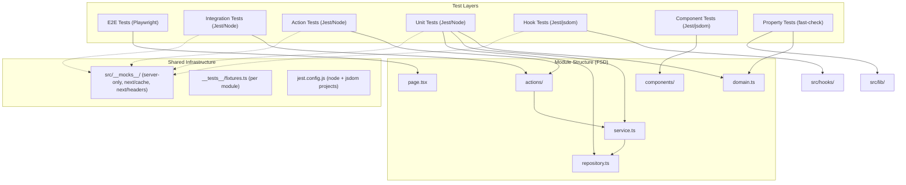

# Design Document: Test Coverage Completion

## Overview

Este documento descreve a abordagem técnica para completar a cobertura de testes do ZattarOS. O projeto utiliza uma arquitetura Feature-Sliced Design (FSD) com colocation, onde cada módulo sob `src/app/(authenticated)/` segue uma estrutura padronizada (domain.ts, service.ts, repository.ts, actions/, components/).

A estratégia de testes é organizada em camadas complementares:

- **Unitários (Jest/Node)**: Testam funções puras em domain.ts, service.ts (com mocks de repository) e repository.ts (com mocks de Supabase client).
- **Actions (Jest/Node)**: Testam Server Actions validando autenticação via `authenticatedAction`, validação Zod de inputs e delegação correta ao service.
- **Integração (Jest/Node)**: Testam fluxos multi-camada (action → service → repository) com mocks apenas na camada de dados Supabase.
- **Hooks (Jest/jsdom)**: Testam custom hooks com `renderHook` do Testing Library, mockando dependências externas (Supabase realtime, Dyte).
- **Componentes (Jest/jsdom)**: Testam componentes React isolados com Testing Library.
- **E2E (Playwright)**: Testam fluxos completos de usuário no navegador.
- **Property-Based (fast-check)**: Testam propriedades universais de funções puras (round-trip, idempotência, invariantes).

O Jest está configurado com dois projetos (`node` e `jsdom`) e `workerIdleMemoryLimit: 512MB` para suportar testes de propriedade com fast-check.

## Architecture



### Design Decisions

1. **Mocks apenas na camada de dados**: Testes de integração mockam apenas o Supabase client, permitindo validar a orquestração real entre action → service → repository.
2. **Fixtures locais por módulo**: Cada módulo define suas factories em `__tests__/fixtures.ts`, evitando dependências entre módulos de teste.
3. **Reutilização de mocks compartilhados**: Os mocks em `src/__mocks__/` (server-only, next/cache, next/headers) são reutilizados por todos os testes via `moduleNameMapper` do Jest.
4. **Separação de ambientes Jest**: Testes `.ts` rodam no ambiente `node`, testes `.tsx` rodam no ambiente `jsdom`.

## Components and Interfaces

### Test File Organization

Cada módulo segue a estrutura de diretórios:

```
src/app/(authenticated)/{modulo}/
  __tests__/
    unit/
      {modulo}.domain.test.ts       # Testes de schemas Zod e regras de domínio
      {modulo}.service.test.ts       # Testes de service com mocks de repository
      {modulo}.repository.test.ts    # Testes de queries Supabase
    actions/
      {modulo}-actions.test.ts       # Testes de Server Actions
    integration/
      {modulo}.integration.test.ts   # Testes de fluxo multi-camada
    e2e/
      {modulo}-flow.spec.ts          # Testes Playwright
    fixtures.ts                      # Factories de dados de teste
```

### Shared Mock Interfaces

```typescript
// src/__mocks__/server-only.js - Mock para import 'server-only'
module.exports = {};

// src/__mocks__/next-cache.js - Mock para next/cache
module.exports = { revalidatePath: jest.fn(), revalidateTag: jest.fn() };

// src/__mocks__/next-headers.js - Mock para next/headers
module.exports = { cookies: jest.fn(), headers: jest.fn() };
```

### Action Test Pattern

```typescript
// Padrão estabelecido para testes de Server Actions
jest.mock('../../services/{modulo}');
jest.mock('next/cache');

describe('action{Nome}', () => {
  beforeEach(() => jest.clearAllMocks());

  it('deve executar com sucesso', async () => {
    (Service.metodo as jest.Mock).mockResolvedValue(mockData);
    const result = await action(validInput);
    expect(Service.metodo).toHaveBeenCalledWith(expectedParams);
    expect(result.success).toBe(true);
  });

  it('deve tratar erros', async () => {
    (Service.metodo as jest.Mock).mockRejectedValue(new Error('Erro'));
    const result = await action(validInput);
    expect(result.success).toBe(false);
  });
});
```

### Hook Test Pattern

```typescript
import { renderHook, act } from '@testing-library/react';

describe('useHookName', () => {
  it('deve gerenciar estado corretamente', () => {
    const { result } = renderHook(() => useHookName(initialProps));
    act(() => { result.current.action(); });
    expect(result.current.state).toBe(expectedState);
  });

  it('deve executar cleanup no unmount', () => {
    const { unmount } = renderHook(() => useHookName());
    unmount();
    expect(cleanupFn).toHaveBeenCalled();
  });
});
```

### Property Test Pattern

```typescript
import fc from 'fast-check';

describe('Property N: {título}', () => {
  // Feature: test-coverage-completion, Property N: {descrição}
  it('{descrição da propriedade}', () => {
    fc.assert(
      fc.property(arbitrary, (input) => {
        // verificação da propriedade
      }),
      { numRuns: 100 },
    );
  });
});
```

## Data Models

### Módulos Sem Testes (11 módulos)

| Módulo | domain.ts | service.ts | repository.ts | actions/ | Prioridade |
|--------|-----------|------------|---------------|----------|------------|
| ajuda | — | — | — | — | Baixa |
| calculadoras | — | — | — | — | Baixa |
| comunica-cnj | ✓ | ✓ | ✓ | ✓ | Alta |
| configuracoes | ✓ | ✓ | ✓ | ✓ | Média |
| editor | — | — | — | — | Baixa |
| mail | ✓ | ✓ | ✓ | ✓ | Alta |
| notas | ✓ | ✓ | ✓ | ✓ | Alta |
| perfil | ✓ | ✓ | — | ✓ | Média |
| project-management | ✓ | ✓ | ✓ | ✓ | Alta |
| repasses | — | — | — | — | Baixa |
| tarefas | ✓ | ✓ | ✓ | ✓ | Alta |

### Módulos Parciais (sem testes de actions)

acervo, admin, advogados, agenda, calendar, captura, cargos, contratos, entrevistas-trabalhistas, expedientes, pecas-juridicas, rh, tipos-expedientes

### Hooks Sem Testes (11 hooks)

use-realtime-presence-room, use-chart-ready, use-realtime-cursors, use-supabase-upload, use-csp-nonce, use-editor-upload, use-render-count, use-twofauth, use-toast, use-realtime-chat, use-realtime-collaboration

### Libs Sem Testes

auth, redis (parcial), logger, mail, storage, twofauth, http, event-aggregation, cron, csp, constants

### Funções Candidatas a Property-Based Testing

| Função | Módulo | Propriedade |
|--------|--------|-------------|
| Zod schemas (noteSchema, createNotaSchema, etc.) | notas, tarefas, mail, etc. | Round-trip |
| calcularSplitPagamento | obrigacoes | Invariante: cliente + escritório = total |
| calcularSaldoDevedor | obrigacoes | Invariante: saldo = total - pago |
| determinarStatusAcordo | obrigacoes | Invariante: status consistente com parcelas |
| formatCurrency, formatCPF, formatCNPJ, formatPhone | lib/design-system | Idempotência |
| isValidCPF, isValidCNPJ | lib/design-system | Corretude: válidos passam, inválidos falham |
| getSemanticBadgeVariant | lib/design-system | Já coberto (variants-property.test.ts) |


## Correctness Properties

*A property is a characteristic or behavior that should hold true across all valid executions of a system — essentially, a formal statement about what the system should do. Properties serve as the bridge between human-readable specifications and machine-verifiable correctness guarantees.*

### Property 1: Zod Schema Round-Trip

*For any* valid domain object that conforms to a Zod schema (noteSchema, createNotaSchema, tarefaSchema, etc.), serializing the object to JSON and parsing it back through the same schema should produce an equivalent object.

**Validates: Requirements 9.1, 1.1**

### Property 2: Zod Schema Rejection of Invalid Data

*For any* input that violates a Zod schema's constraints (missing required fields, wrong types, values outside allowed ranges), parsing through the schema should throw a ZodError. This applies to domain schemas, action input schemas, and API route schemas.

**Validates: Requirements 1.1, 2.3, 8.3**

### Property 3: Financial Calculation Split Invariant

*For any* non-negative principal value, non-negative sucumbência value, and percentage between 0 and 100, `calcularSplitPagamento` should satisfy: `valorRepasseCliente + valorEscritorio === valorTotal` and `valorTotal === valorPrincipal + honorariosSucumbenciais`.

**Validates: Requirements 9.2**

### Property 4: Formatting Idempotence

*For any* valid input (11-digit CPF string, 14-digit CNPJ string, numeric currency value, 10-11 digit phone string), applying the corresponding format function twice should produce the same result as applying it once: `format(format(x)) === format(x)`.

**Validates: Requirements 9.3**

### Property 5: CPF/CNPJ Validation Correctness

*For any* algorithmically generated valid CPF (using the check-digit algorithm), `isValidCPF` should return true. *For any* random 11-digit string that does not satisfy the CPF check-digit algorithm, `isValidCPF` should return false. The same applies to `isValidCNPJ` with 14-digit strings.

**Validates: Requirements 9.4**

## Error Handling

### Estratégia de Erros em Testes

1. **Server Actions**: Todas as actions retornam `{ success: boolean; data?: T; error?: string }`. Testes devem verificar que erros do service são capturados e retornados com `success: false`.

2. **Service Layer**: Services lançam exceções para erros de validação e propagam erros do repository. Testes devem verificar que:
   - Erros de validação de domínio são lançados antes de chamar o repository
   - Erros do repository são propagados corretamente

3. **Repository Layer**: Repositories propagam erros do Supabase client. Testes devem verificar que queries malformadas ou erros de conexão são tratados.

4. **Hooks**: Hooks que interagem com APIs externas devem tratar erros graciosamente sem crashar o componente. Testes devem verificar estados de erro.

5. **Property Tests**: Testes de propriedade devem incluir edge cases nos generators (valores zero, strings vazias, limites de range) para descobrir erros em boundary conditions.

### Mocks de Erro Padrão

```typescript
// Padrão para testar erros em actions
(Service.metodo as jest.Mock).mockRejectedValue(new Error('Erro simulado'));
const result = await action(input);
expect(result.success).toBe(false);
expect(result.error).toBeDefined();

// Padrão para testar erros em services
(Repository.metodo as jest.Mock).mockRejectedValue(new Error('DB error'));
await expect(Service.metodo(input)).rejects.toThrow('DB error');

// Padrão para testar erros em hooks
const mockChannel = { on: jest.fn().mockReturnThis(), subscribe: jest.fn() };
// Simular erro de conexão
mockChannel.subscribe.mockImplementation((cb) => cb('CHANNEL_ERROR'));
```

## Testing Strategy

### Abordagem Dual: Unit Tests + Property Tests

A suíte de testes combina duas abordagens complementares:

- **Unit tests (example-based)**: Verificam cenários específicos, edge cases e integração entre camadas. Cobrem a maioria dos requisitos (1.2, 1.3, 2.1, 2.2, 2.4, 3.x, 4.x, 5.x, 6.x, 7.x, 8.x, 10.x).
- **Property tests (fast-check)**: Verificam propriedades universais que devem valer para todos os inputs válidos. Cobrem requisitos 9.x e complementam 1.1, 2.3, 8.3.

### Configuração de Property Tests

- **Biblioteca**: `fast-check` v3.15+ (já instalada como devDependency)
- **Iterações**: Mínimo 100 por propriedade (`{ numRuns: 100 }`)
- **Ambiente**: Jest/Node (funções puras não precisam de jsdom)
- **Memória**: `workerIdleMemoryLimit: 512MB` já configurado no jest.config.js
- **Tag format**: `Feature: test-coverage-completion, Property {number}: {property_text}`

### Priorização de Implementação

1. **P0 — Módulos críticos sem testes**: notas, tarefas, mail, project-management, comunica-cnj (unit + actions)
2. **P1 — Actions de módulos parciais**: 13 módulos com actions sem testes
3. **P2 — Property tests**: 5 propriedades para funções de domínio e formatação
4. **P3 — Hooks sem testes**: 11 hooks
5. **P4 — Libs sem testes**: auth, redis, logger, mail, storage, etc.
6. **P5 — Integration tests**: Fluxos multi-camada para módulos críticos
7. **P6 — E2E tests**: Playwright para módulos CRUD críticos
8. **P7 — API route tests**: Rotas com lógica de negócio
9. **P8 — Módulos simples**: ajuda, calculadoras, editor, repasses (menor prioridade)

### Estimativa de Testes

| Camada | Testes Estimados | Módulos |
|--------|-----------------|---------|
| Unit (domain/service/repo) | ~80-100 | 11 módulos sem testes |
| Actions | ~60-80 | 11 sem testes + 13 parciais |
| Integration | ~20-30 | 11 módulos críticos |
| Hooks | ~30-40 | 11 hooks |
| Libs | ~40-50 | ~11 libs |
| E2E | ~15-20 | 8 módulos críticos |
| Property | ~10-15 | 5 propriedades |
| API Routes | ~10-15 | Rotas com lógica |
| **Total** | **~265-350** | — |
